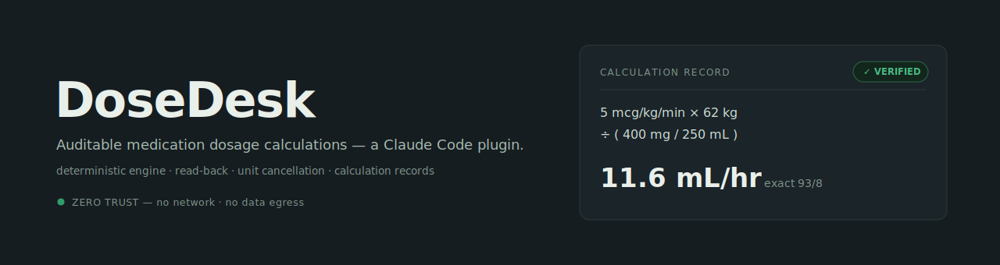

# DoseDesk

**A medication calculator you can hand to a surveyor — and a tutor that never guesses.**

Most medication-math tools compute. None of them can be *audited*. DoseDesk is a Claude
plugin that performs, verifies, and **documents** dosage calculations — deterministically,
with the unit cancellation shown, inputs read back for confirmation, drug data sourced and
version-stamped, error-prone notation flagged, high-alert drugs guarded, and a defensible
audit record emitted for every result. A separate tutor mode teaches and generates
practice, backed by the same engine so the teaching answer is never wrong.

## The safety boundary is the architecture

DoseDesk is split into two skills with **deliberately disjoint** triggering, because the
line between calculating and teaching is a safety boundary, not a UX choice:

- **`dose-calculator`** — strict verification of a *real* order. Never infers a missing
  weight, concentration, rounding rule, or "typical" dose; reads inputs back before
  computing; routes everything through the engine; returns an audit record. Fails **closed**:
  ambiguous input is treated as a real calculation, not practice.
- **`dose-tutor`** — teaching and practice, where hypothetical values are expected. Hands
  off to `dose-calculator` the moment a scenario turns out to be a real patient.

`/dose` is a plain router into verify / practice / review. The doorway biases the mode;
the strict rules live in the skills.

## Why it's different

- **The LLM never does the arithmetic.** All math runs in a deterministic engine using
  exact rational values (no floating-point drift), rounding only at one explicit terminal
  step. Reproducible to the digit.
- **Units must cancel or it refuses to answer.** No silent unit guessing.
- **Every result is an audit record** — inputs, formula, unit-cancellation trace, exact
  intermediate, rounding rule, warnings, engine version — so the basis is independently
  reviewable.
- **Safety fires in code** — error-prone abbreviations, high-alert double-check prompts,
  pediatric-exceeds-adult-max halts, bag-runs-dry and pump-max flags. Plus read-back at the
  skill layer.
- **Plausibility that won't cry wolf.** A separate, sourced layer grades a computed value
  (NORMAL / HIGH_REVIEW / UNKNOWN) with the confidence traveling alongside, worded as
  "verify," never "wrong." Absence of a range yields UNKNOWN, never a false NORMAL.
- **Copyright-clean & Zero Trust** — public-domain data only (openFDA / DailyMed / RxNorm),
  standard library only, no external dependencies, no data egress. Works offline.

## Layout

```
dosedesk/
├── .claude-plugin/
│   ├── plugin.json                  # plugin manifest (name=dosedesk, v0.1.1)
│   └── marketplace.json             # self-hostable marketplace entry (local install + optional distribution)
├── commands/dose.md                 # /dose router
├── skills/
│   ├── dose-calculator/SKILL.md     # strict: verify real orders, no inference, read-back
│   └── dose-tutor/SKILL.md          # teach + practice, hands off on real orders
├── engine/
│   ├── dosedesk_engine.py           # deterministic math of record (Python, exact arithmetic)
│   ├── dosedesk_engine.js           # portable JS port (BigInt exact arithmetic, browser)
│   ├── plausibility.py              # graded, confidence-tagged plausibility layer
│   ├── gen_parity_vectors.py        # emits golden vectors from the Python engine of record
│   └── tests/
│       ├── test_engine.py           # golden + property + guardrail + plausibility (31 checks)
│       └── parity.test.js           # proves the JS engine reproduces Python exactly (Node)
├── web/                             # the signature single-file browser demo
│   ├── dosedesk.html                # self-contained: inlined engine, self-auditing parity stamp
│   ├── dosedesk.template.html       # template with build placeholders
│   └── build.py                     # inlines engine + vectors into dosedesk.html
├── provenance/
│   ├── safety_bounds.json           # curated high-alert ceilings (facts, versioned)
│   ├── plausibility_ranges.json     # sourced reference ranges (seed)
│   ├── plausibility_ranges.schema.json  # provenance REQUIRED before any data
│   ├── parity_vectors.json          # golden vectors: JS must match Python of record
│   ├── label_snapshots/             # (v0.3) versioned openFDA/DailyMed label snapshots
│   └── DRUG-DATA-VERSION.md         # versioned data changelog
├── docs/
│   ├── DATA-SOURCES.md              # copyright posture & clean wells
│   ├── VALIDATION.md                # validation dashboard + release history
│   └── COLD-RUN-TESTS.md            # adversarial behavioral tests for live-install verification
└── README.md
```

## Run the tests

```bash
python -m engine.tests.test_engine     # 31/31: golden + property + guardrail + plausibility
node engine/tests/parity.test.js       # 12/12: JS engine reproduces the Python vectors exactly
```

## Browser demo — the signature single-file HTML

`web/dosedesk.html` opens in any browser with no server, no dependencies, and no data
egress (Zero Trust). It is not a prettier calculator: it exposes the moat. It reads the
order back before calculating, renders each result as an audit record with the unit
cancellation shown, grades plausibility with confidence attached, and holds a calculation
when it detects error-prone notation (see the insulin `5u` demo).

Because a browser cannot run the Python engine, the demo carries a JS port — a *second*
implementation, which is a safety risk unless the two are proven to agree. So the HTML
**self-audits on load**: it runs the golden vectors through its inlined engine and shows a
parity stamp ("ENGINE VERIFIED — n/n match the plugin engine of record") before any number
is trusted. Rebuild after an engine change:

```bash
python -m engine.gen_parity_vectors    # regenerate golden vectors from Python of record
python web/build.py                    # re-inline engine + vectors into dosedesk.html
```

## Scope

DoseDesk supports and documents a calculation; it does not replace clinical judgment and
must not be the sole basis for administering a medication. Values come from the user and
from public labeling and must be verified against current institutional policy, the
prescriber's order, and the product's actual label. DoseDesk makes no regulatory-status
claim (not "FDA approved," "FDA compliant," or "CDS-exempt") — those depend on intended
use and are outside the tool's authority to assert.

## Roadmap

- **v0.1.1 (this build):** skill split, `/dose`, read-back, tutor handoff, provenance
  schema + plausibility framework (seed ranges).
- **v0.2:** expand hand-verified plausibility ranges; pattern-family practice templates.
- **v0.3:** openFDA/DailyMed label-snapshot ingestion + version diffing.
- **v0.4:** instructor mode — competency exams, class assignments, remediation.

## Built by

Tanni — clinical quality abstractor, vibe code hobbyist, and web design enthusiast. She loves her dog, Sawyer.

Chief Morale Officer duties handled by Sawyer, who appears when you least expect him.

MIT licensed. Part of the AbstractionDesk tool family.
